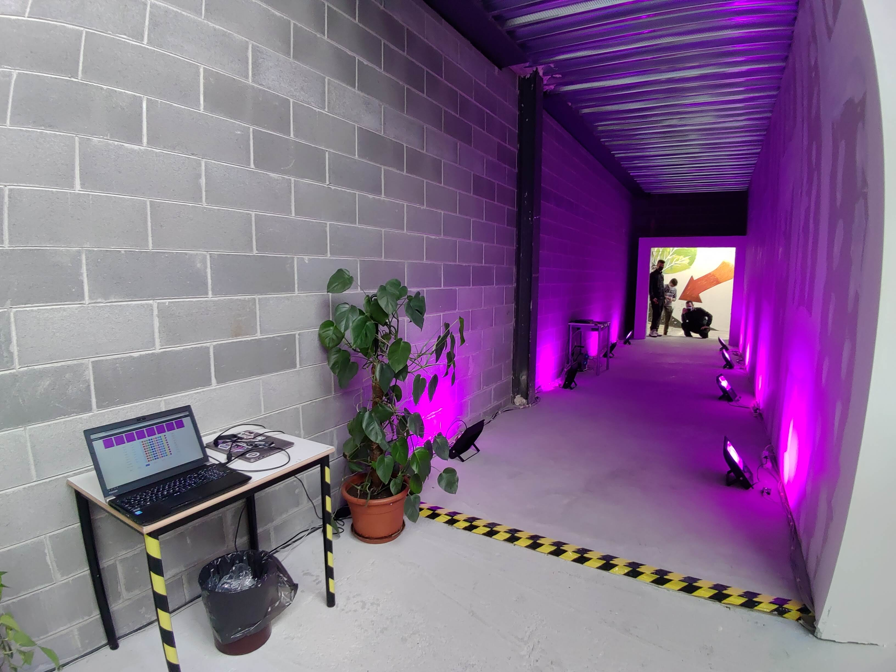
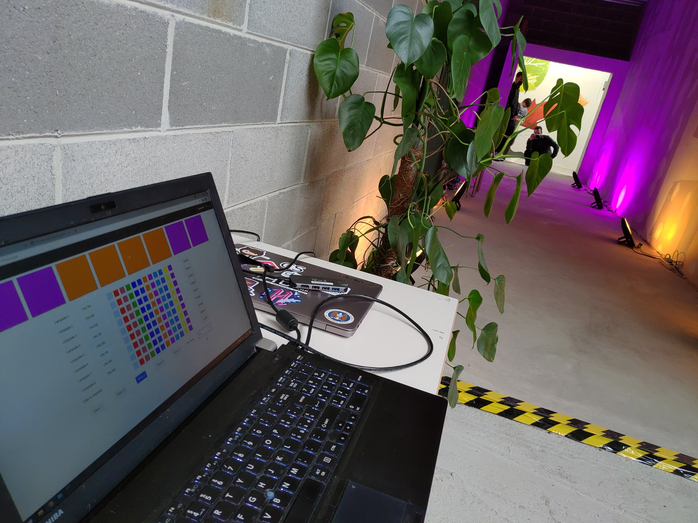
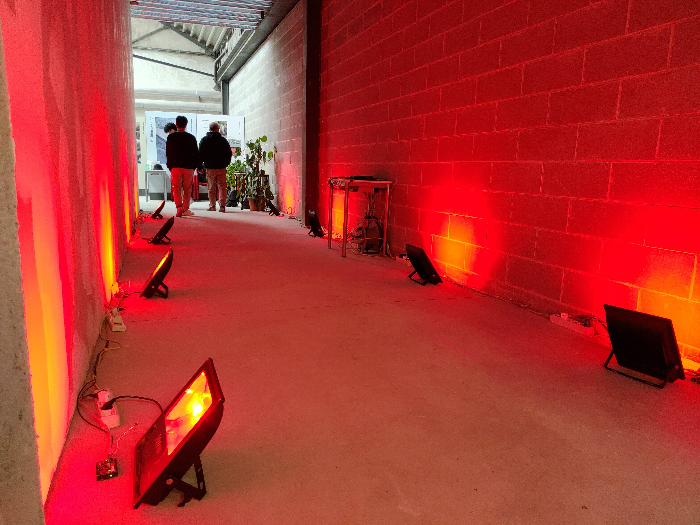
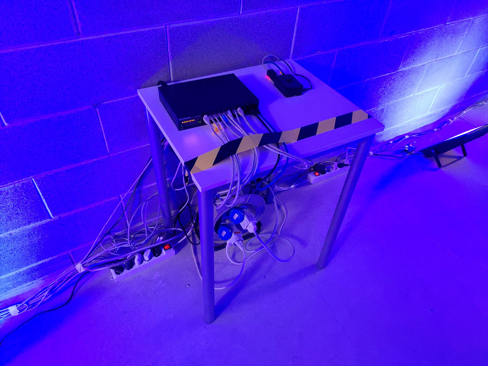

# Institutional event
On 2021-05-15 we had the opportunity to present the project at an institutional event of the [ITIS Paleocapa](https://www.itispaleocapa.edu.it/).

We basically used the same configuration and software used during the [Barcella fair](../2019.05%20-%20Project%20Lamp%20Barcella), so there are no additional or updated scripts here.

However, we had some little problems during the staging, and we decided to report them it for future reference.

Due to the disappearance of an Ethernet Shield, we had to replace it with another one.

Unfortunately it wasn't the same model as the ones we used to use ([Ethernet Shield 2](https://web.archive.org/web/20160302072209/http://www.arduino.org/products/shields/5-arduino-shields/arduino-ethernet-shield-2), made by arduino.org), but it was an [Ethernet Shield V1](https://www.arduino.cc/en/Main/ArduinoEthernetShieldV1), made by arduino.cc).

We therefore had to reupload the sketch on an Arduino, replacing the Ethernet2 library with the Ethernet library (just edit line 2 of [shetch.ino](../2018.05.31%20-%20Final%20outcome/sketch.ino)).

Having done this, we encountered problems with the IR LED, and found that the new version of the [IRremote](https://github.com/Arduino-IRremote/Arduino-IRremote) library behaves differently to the version we initially used. We therefore had to get an old version of the library, and recompile the sketch with it.

For the sake of completeness, all 3 libraries used have been published in the repository, to avoid future problems with different versions:
- [Ethernet.h](../Ethernet.zip) (Ethernet Shield V1, arduino.cc)
- [Ethernet2.h](../Ethernet2.zip) (Ethernet Shield 2, arduino.org)
- [IRremote](../IRremote.zip)

## Pictures of the installation

